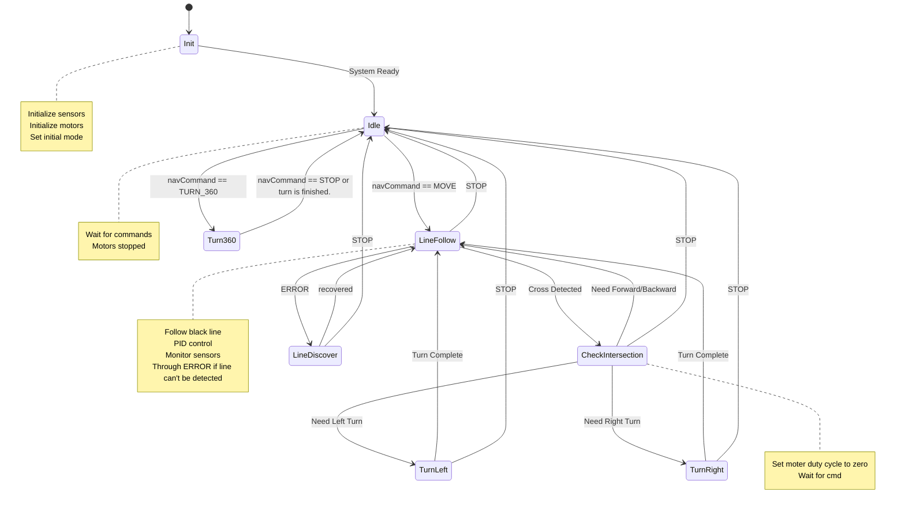

```mermaid
stateDiagram-v2
    [*] --> Init
    
    Init --> Idle: System Ready
    note right of Init
        Initialize sensors
        Initialize motors
        Set initial mode
    end note

    Idle --> LineFollow: navCommand == MOVE
    Idle --> Turn360: navCommand == TURN_360
    note right of Idle
        Wait for commands
        Motors stopped
    end note

    Turn360 --> Idle: navCommand == STOP or turn is finished.

    LineFollow --> CheckIntersection: Cross Detected
    LineFollow --> Idle: STOP
    LineFollow --> LineDiscover: ERROR
    note right of LineFollow
        Follow black line
        PID control
        Monitor sensors
        Through ERROR if line can't be detected
    end note

    CheckIntersection --> TurnLeft: Need Left Turn
    CheckIntersection --> TurnRight: Need Right Turn
    CheckIntersection --> LineFollow: Need Forward/Backward
    CheckIntersection --> Idle: STOP
    note right of CheckIntersection
        Set moter duty cycle to zero
        Wait for cmd
    end note

    TurnLeft --> LineFollow: Turn Complete
    TurnRight --> LineFollow: Turn Complete

    TurnLeft --> Idle: STOP
    TurnRight --> Idle: STOP

    LineDiscover --> LineFollow: recovered
    LineDiscover --> Idle: STOP

    

```