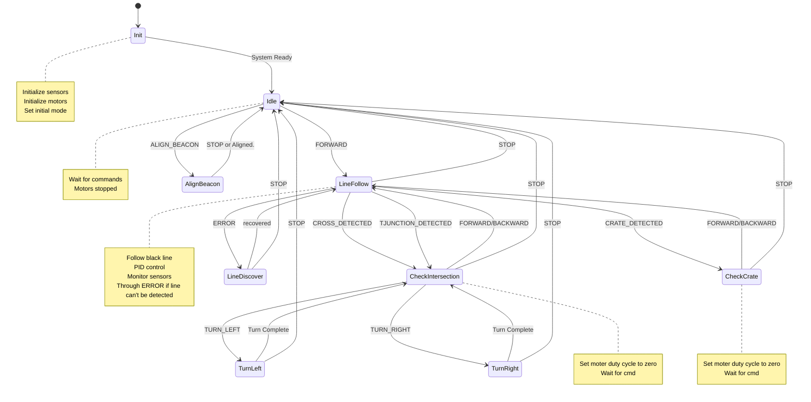

```mermaid
stateDiagram-v2
    [*] --> Init
    
    Init --> Idle: System Ready
    note right of Init
        Initialize sensors
        Initialize motors
        Set initial mode
    end note

    Idle --> LineFollow: FORWARD
    Idle --> AlignBeacon: ALIGN_BEACON
    note right of Idle
        Wait for commands
        Motors stopped
    end note

    AlignBeacon --> Idle: STOP or Aligned.

    LineFollow --> CheckCrate: CRATE_DETECTED
    LineFollow --> CheckIntersection: CROSS_DETECTED
    LineFollow --> Idle: STOP
    LineFollow --> LineDiscover: ERROR
    LineFollow --> CheckIntersection: TJUNCTION_DETECTED
    note right of LineFollow
        Follow black line
        PID control
        Monitor sensors
        Through ERROR if line can't be detected
    end note

    CheckIntersection --> TurnLeft: TURN_LEFT
    CheckIntersection --> TurnRight: TURN_RIGHT
    CheckIntersection --> LineFollow: FORWARD/BACKWARD
    CheckIntersection --> Idle: STOP
    note right of CheckIntersection
        Set moter duty cycle to zero
        Wait for cmd
    end note

    TurnLeft --> CheckIntersection: Turn Complete
    TurnRight --> CheckIntersection: Turn Complete

    TurnLeft --> Idle: STOP
    TurnRight --> Idle: STOP

    LineDiscover --> LineFollow: recovered
    LineDiscover --> Idle: STOP

    CheckCrate --> LineFollow: FORWARD/BACKWARD
    CheckCrate --> Idle: STOP
    note right of CheckCrate
        Set moter duty cycle to zero
        Wait for cmd
    end note

    

```