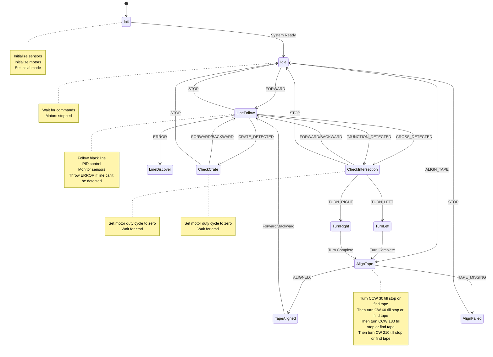

```mermaid
stateDiagram-v2
    [*] --> Init
    
    Init --> Idle: System Ready
    note right of Init
        Initialize sensors
        Initialize motors
        Set initial mode
    end note

    Idle --> LineFollow: FORWARD
    Idle --> AlignTape: ALIGN_TAPE
    note right of Idle
        Wait for commands
        Motors stopped
    end note

    AlignTape --> TapeAligned: ALIGNED.
    note right of AlignTape
        Turn CCW 30 till stop or find tape
        Then turn CW 60 till stop or find tape
        Then turn CCW 180 till stop or find tape
        Then turn CW 210 till stop or find tape
    end note

    AlignTape --> AlignFailed: TAPE_MISSING
    
    LineFollow --> CheckCrate: CRATE_DETECTED
    LineFollow --> CheckIntersection: CROSS_DETECTED
    LineFollow --> Idle: STOP
    LineFollow --> LineDiscover: ERROR
    LineFollow --> CheckIntersection: TJUNCTION_DETECTED
    note right of LineFollow
        Follow black line
        PID control
        Monitor sensors
        Throw ERROR if line can't be detected
    end note

    CheckIntersection --> TurnLeft: TURN_LEFT
    CheckIntersection --> TurnRight: TURN_RIGHT
    CheckIntersection --> LineFollow: FORWARD/BACKWARD
    CheckIntersection --> Idle: STOP
    note right of CheckIntersection
        Set motor duty cycle to zero
        Wait for cmd
    end note

    TurnLeft --> AlignTape: Turn Complete
    TurnRight --> AlignTape: Turn Complete

    TapeAligned --> LineFollow: Forward/Backward
    AlignFailed --> Idle: STOP

    CheckCrate --> LineFollow: FORWARD/BACKWARD
    CheckCrate --> Idle: STOP
    note right of CheckCrate
        Set motor duty cycle to zero
        Wait for cmd
    end note

    

```