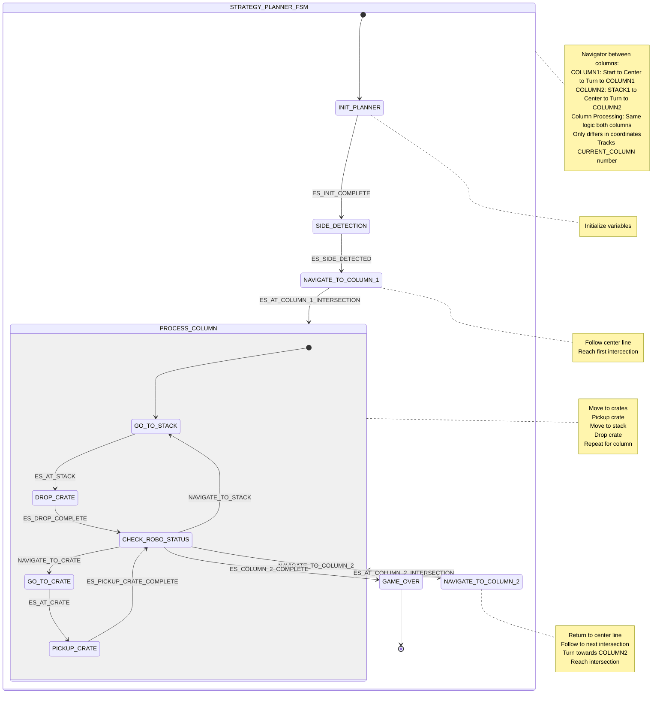

```mermaid
stateDiagram-v2
    state "STRATEGY_PLANNER_FSM" as PLANNER_FSM {
        [*] --> INIT_PLANNER
        
        INIT_PLANNER --> SIDE_DETECTION: ES_INIT_COMPLETE
        SIDE_DETECTION --> NAVIGATE_TO_COLUMN_1: ES_SIDE_DETECTED
        
        note right of INIT_PLANNER
            Initialize variables
        end note

        NAVIGATE_TO_COLUMN_1 --> PROCESS_COLUMN: ES_AT_COLUMN_1_INTERSECTION
        
        note right of NAVIGATE_TO_COLUMN_1
            Follow center line
            Reach first intercection
        end note

        state PROCESS_COLUMN {
            [*] --> GO_TO_STACK
            GO_TO_STACK --> DROP_CRATE: ES_AT_STACK
            DROP_CRATE --> CHECK_ROBO_STATUS: ES_DROP_COMPLETE
            CHECK_ROBO_STATUS --> GO_TO_CRATE: NAVIGATE_TO_CRATE
            GO_TO_CRATE --> PICKUP_CRATE: ES_AT_CRATE

            PICKUP_CRATE --> CHECK_ROBO_STATUS: ES_PICKUP_CRATE_COMPLETE
            CHECK_ROBO_STATUS --> GO_TO_STACK: NAVIGATE_TO_STACK
            CHECK_ROBO_STATUS --> NAVIGATE_TO_COLUMN_2: NAVIGATE_TO_COLUMN_2
            CHECK_ROBO_STATUS --> GAME_OVER: ES_COLUMN_2_COMPLETE
        }

        NAVIGATE_TO_COLUMN_2 --> PROCESS_COLUMN: ES_AT_COLUMN_2_INTERSECTION
        
        note right of PROCESS_COLUMN
            Move to crates
            Pickup crate
            Move to stack
            Drop crate
            Repeat for column
        end note
        
        note right of NAVIGATE_TO_COLUMN_2
            Return to center line
            Follow to next intersection
            Turn towards COLUMN2
            Reach intersection
        end note
        
        GAME_OVER --> [*]
    }

    note right of PLANNER_FSM
        Navigator between columns:
        COLUMN1: Start to Center to Turn to COLUMN1
        COLUMN2: STACK1 to Center to Turn to COLUMN2
        Column Processing: Same logic both columns
        Only differs in coordinates
        Tracks CURRENT_COLUMN number
    end note
```
