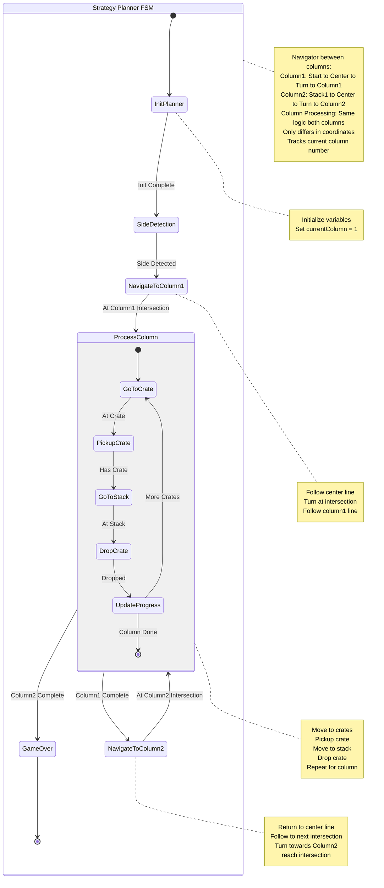

```mermaid
stateDiagram-v2
    state "Strategy Planner FSM" as PlannerFSM {
        [*] --> InitPlanner
        
        InitPlanner --> SideDetection: Init Complete
        SideDetection --> NavigateToColumn1: Side Detected
        note right of InitPlanner
            Initialize variables
            Set currentColumn = 1
        end note

        NavigateToColumn1 --> ProcessColumn: At Column1 Intersection
        note right of NavigateToColumn1
            Follow center line
            Turn at intersection
            Follow column1 line
        end note

        state ProcessColumn {
            [*] --> GoToCrate
            GoToCrate --> PickupCrate: At Crate
            PickupCrate --> GoToStack: Has Crate
            GoToStack --> DropCrate: At Stack
            DropCrate --> UpdateProgress: Dropped
            UpdateProgress --> GoToCrate: More Crates
            UpdateProgress --> [*]: Column Done
        }

        ProcessColumn --> NavigateToColumn2: Column1 Complete
        note right of ProcessColumn
            Move to crates
            Pickup crate
            Move to stack
            Drop crate
            Repeat for column
        end note

        NavigateToColumn2 --> ProcessColumn: At Column2 Intersection
        note right of NavigateToColumn2
            Return to center line
            Follow to next intersection
            Turn towards Column2
            reach intersection
        end note

        ProcessColumn --> GameOver: Column2 Complete
        
        GameOver --> [*]
    }

    note right of PlannerFSM
        Navigator between columns:
        Column1: Start to Center to Turn to Column1
        Column2: Stack1 to Center to Turn to Column2
        Column Processing: Same logic both columns
        Only differs in coordinates
        Tracks current column number
    end note
```