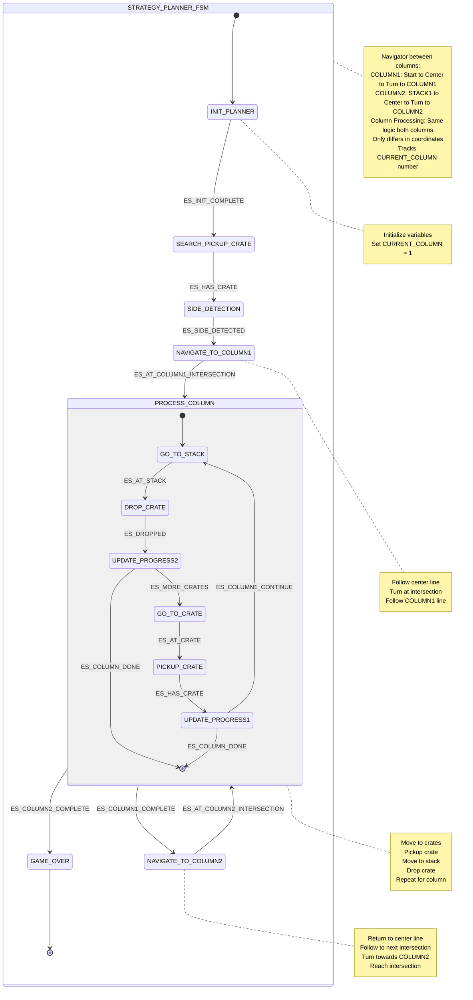

```mermaid
stateDiagram-v2
    state "STRATEGY_PLANNER_FSM" as PLANNER_FSM {
        [*] --> INIT_PLANNER
        
        INIT_PLANNER --> SEARCH_PICKUP_CRATE: ES_INIT_COMPLETE
        SEARCH_PICKUP_CRATE --> SIDE_DETECTION: ES_HAS_CRATE
        SIDE_DETECTION --> NAVIGATE_TO_COLUMN1: ES_SIDE_DETECTED
        
        note right of INIT_PLANNER
            Initialize variables
            Set CURRENT_COLUMN = 1
        end note

        NAVIGATE_TO_COLUMN1 --> PROCESS_COLUMN: ES_AT_COLUMN1_INTERSECTION
        
        note right of NAVIGATE_TO_COLUMN1
            Follow center line
            Turn at intersection
            Follow COLUMN1 line
        end note

        state PROCESS_COLUMN {
            [*] --> GO_TO_STACK
            GO_TO_STACK --> DROP_CRATE: ES_AT_STACK
            DROP_CRATE --> UPDATE_PROGRESS2: ES_DROPPED
            UPDATE_PROGRESS2 --> GO_TO_CRATE: ES_MORE_CRATES
            GO_TO_CRATE --> PICKUP_CRATE: ES_AT_CRATE

            PICKUP_CRATE --> UPDATE_PROGRESS1: ES_HAS_CRATE
            UPDATE_PROGRESS1 --> GO_TO_STACK: ES_COLUMN1_CONTINUE

            UPDATE_PROGRESS2 --> [*]: ES_COLUMN_DONE
            UPDATE_PROGRESS1 --> [*]: ES_COLUMN_DONE
        }

        PROCESS_COLUMN --> NAVIGATE_TO_COLUMN2: ES_COLUMN1_COMPLETE
        
        note right of PROCESS_COLUMN
            Move to crates
            Pickup crate
            Move to stack
            Drop crate
            Repeat for column
        end note

        NAVIGATE_TO_COLUMN2 --> PROCESS_COLUMN: ES_AT_COLUMN2_INTERSECTION
        
        note right of NAVIGATE_TO_COLUMN2
            Return to center line
            Follow to next intersection
            Turn towards COLUMN2
            Reach intersection
        end note

        PROCESS_COLUMN --> GAME_OVER: ES_COLUMN2_COMPLETE
        
        GAME_OVER --> [*]
    }

    note right of PLANNER_FSM
        Navigator between columns:
        COLUMN1: Start to Center to Turn to COLUMN1
        COLUMN2: STACK1 to Center to Turn to COLUMN2
        Column Processing: Same logic both columns
        Only differs in coordinates
        Tracks CURRENT_COLUMN number
    end note
```
