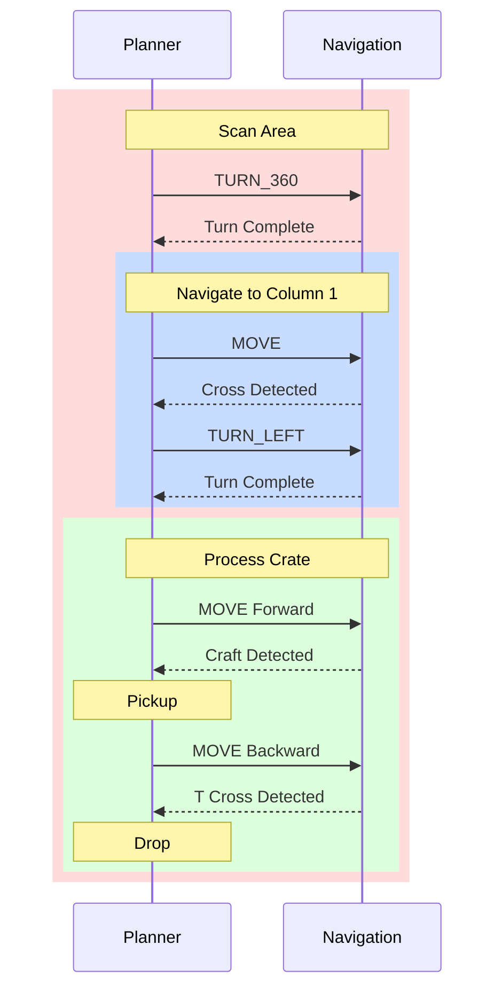

```mermaid
sequenceDiagram
    participant Planner
    participant Navigation

    rect rgb(255, 220, 220)
    Note over Planner,Navigation: Scan Area
    Planner->>Navigation: TURN_360
    Navigation-->>Planner: Turn Complete

    rect rgb(200, 220, 255)
    Note over Planner,Navigation: Navigate to Column 1
    Planner->>Navigation: MOVE
    Navigation-->>Planner: Cross Detected
    Planner->>Navigation: TURN_LEFT
    Navigation-->>Planner: Turn Complete
    end

    rect rgb(220, 255, 220)
    Note over Planner,Navigation: Process Crate
    Planner->>Navigation: MOVE Forward
    Navigation-->>Planner: Craft Detected
    Note over Planner: Pickup
    Planner->>Navigation: MOVE Backward
    Navigation-->>Planner: T Cross Detected
    Note over Planner: Drop
    end

    end
```