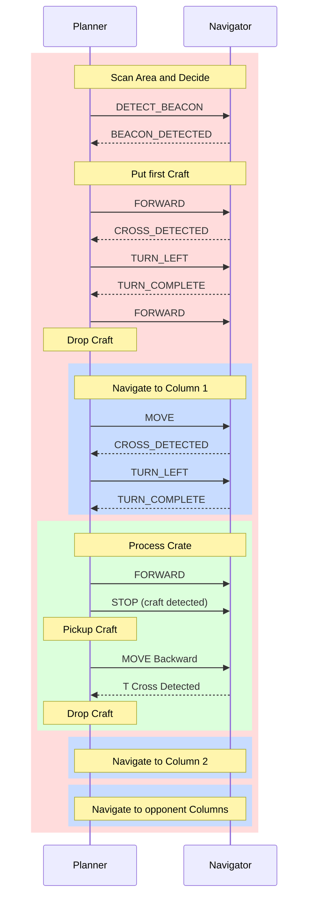

```mermaid
sequenceDiagram
    participant Planner
    participant Navigator

    rect rgb(255, 220, 220)
    Note over Planner,Navigator: Scan Area and Decide
    Planner->>Navigator: DETECT_BEACON
    Navigator-->>Planner: BEACON_DETECTED

    rect rgb(255, 220, 220)
    Note over Planner,Navigator: Put first Craft
    Planner->>Navigator: FORWARD
    Navigator-->>Planner: CROSS_DETECTED
    Planner->>Navigator: TURN_LEFT
    Navigator-->>Planner: TURN_COMPLETE
    Planner->>Navigator: FORWARD
    Note over Planner: Drop Craft
    end

    rect rgb(200, 220, 255)
    Note over Planner,Navigator: Navigate to Column 1
    Planner->>Navigator: MOVE
    Navigator-->>Planner: CROSS_DETECTED
    Planner->>Navigator: TURN_LEFT
    Navigator-->>Planner: TURN_COMPLETE
    end

    rect rgb(220, 255, 220)
    Note over Planner,Navigator: Process Crate
    Planner->>Navigator: FORWARD
    Planner->>Navigator: STOP (craft detected)
    Note over Planner: Pickup Craft
    Planner->>Navigator: MOVE Backward
    Navigator-->>Planner: T Cross Detected
    Note over Planner: Drop Craft
    end

    rect rgb(200, 220, 255)
    Note over Planner,Navigator: Navigate to Column 2
    end

    rect rgb(200, 220, 255)
    Note over Planner,Navigator: Navigate to opponent Columns
    end

    end
```